# Отчет: Terraform - Part1

Файл main.tf

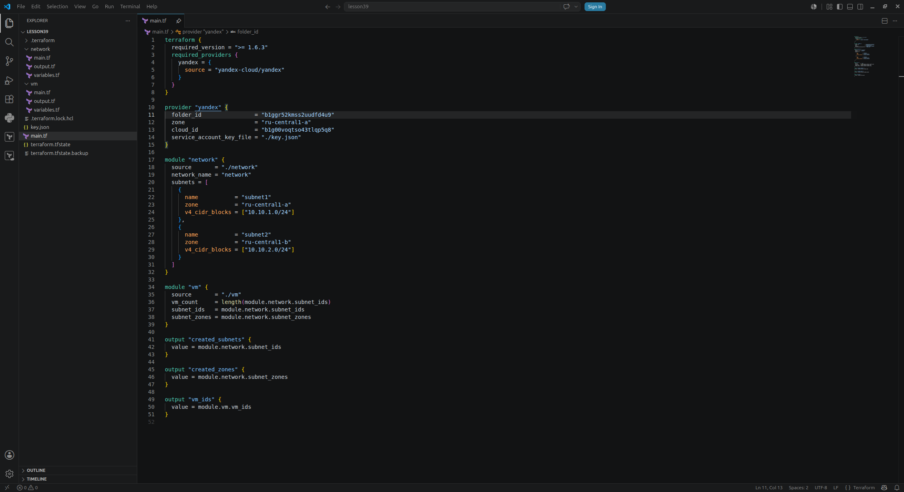

Модуль vm

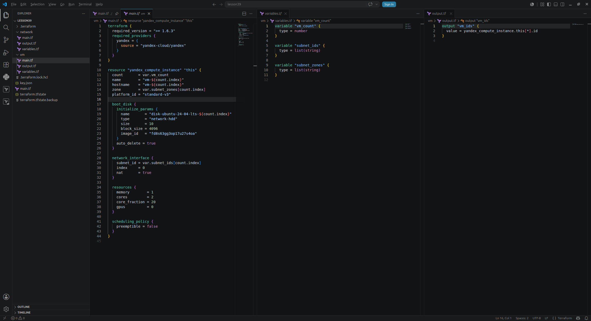

Модуль network

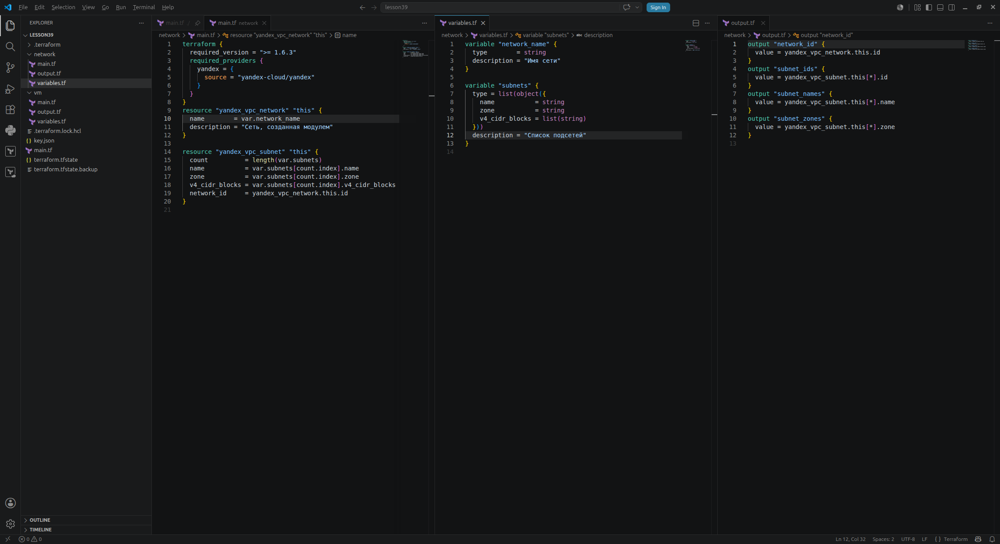

terraform init

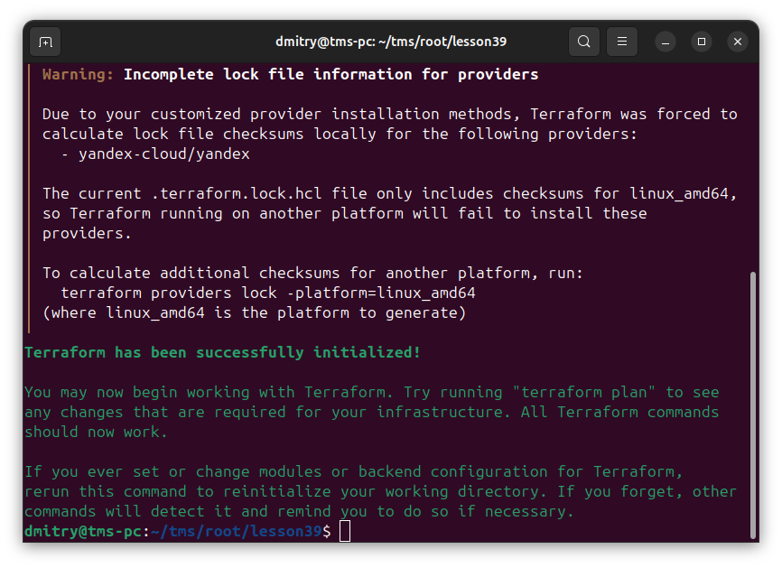

terraform plan

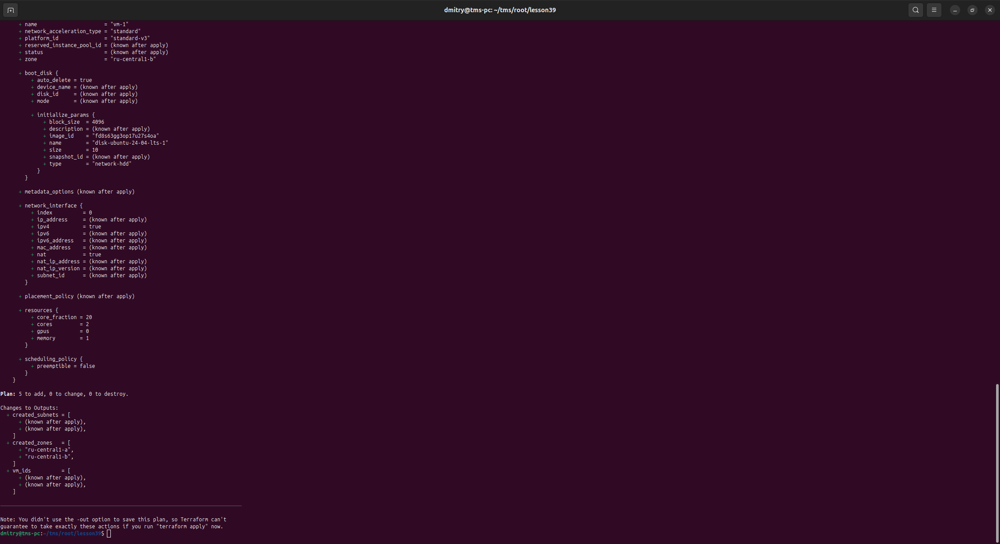

terraform apply

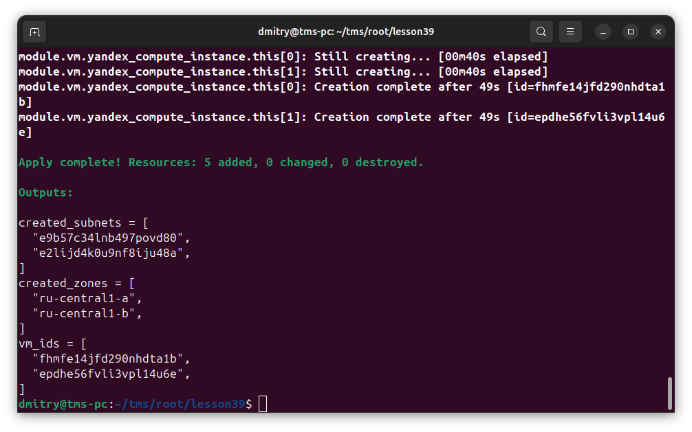

Меняем имя сети

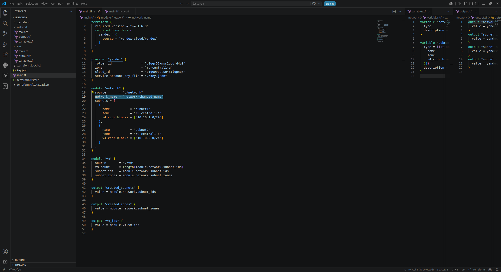

снова terraform plan

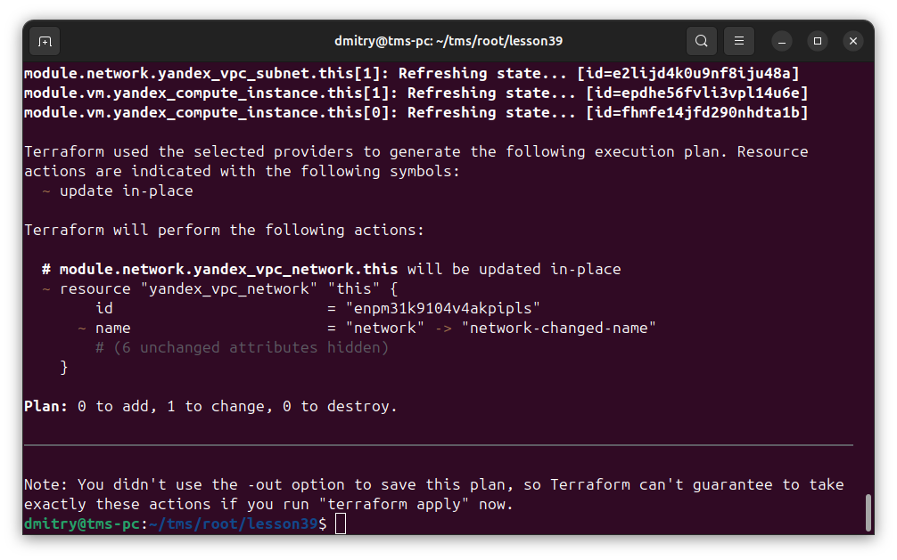

снова terraform apply

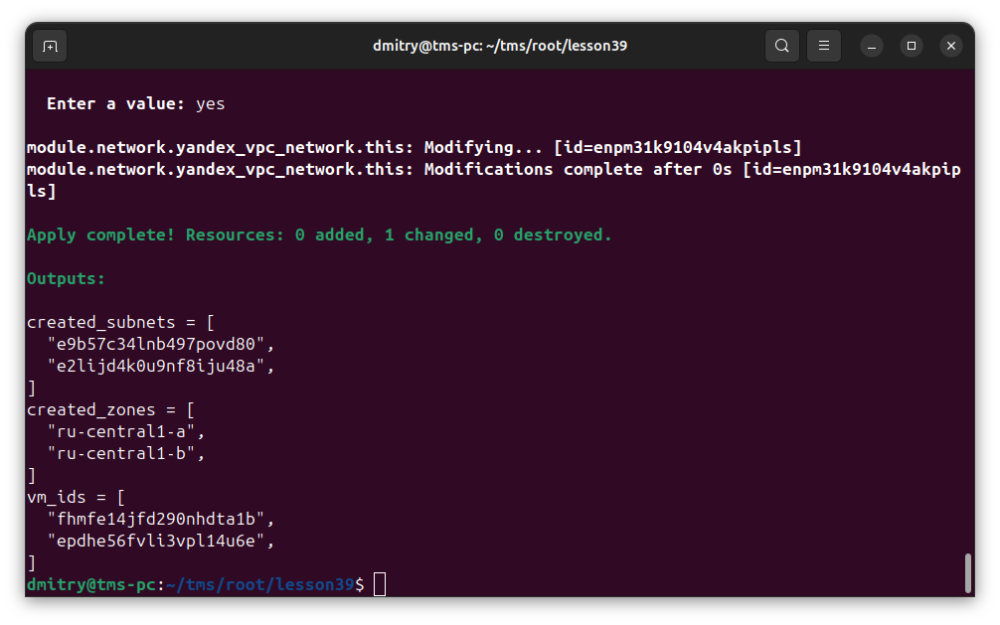

Проверяем, что виртулки созданы

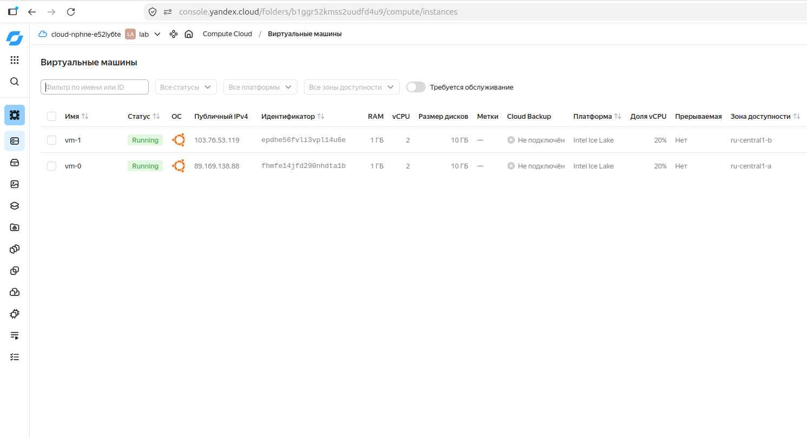

terraform destroy

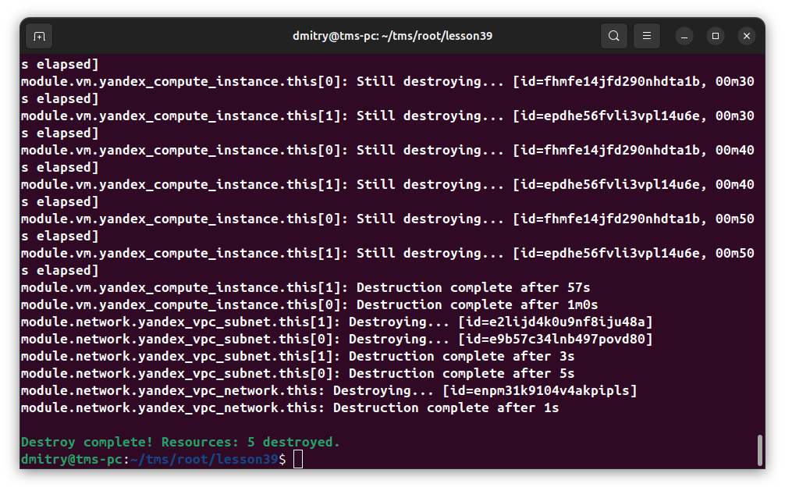