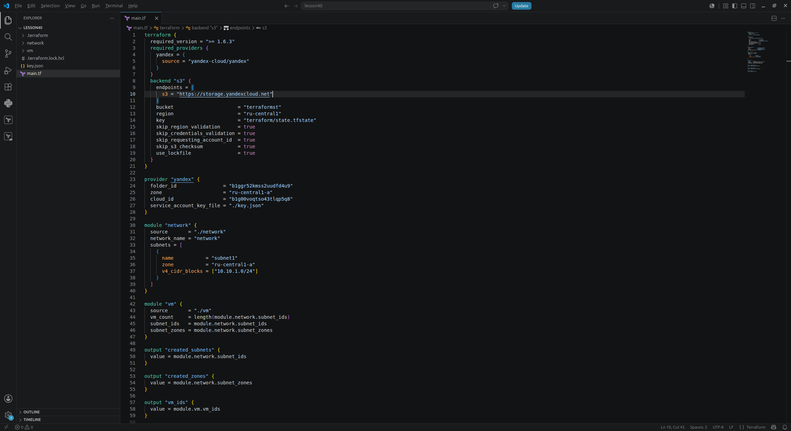
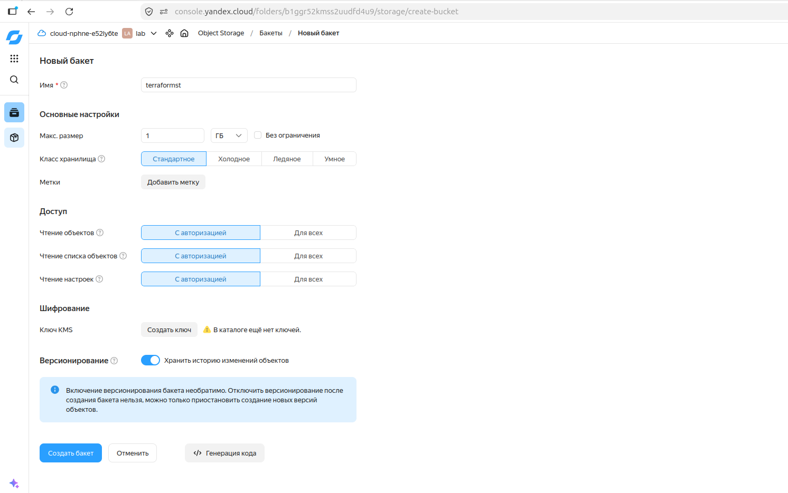
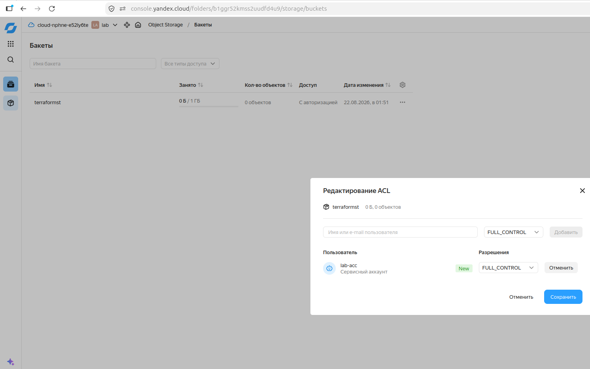
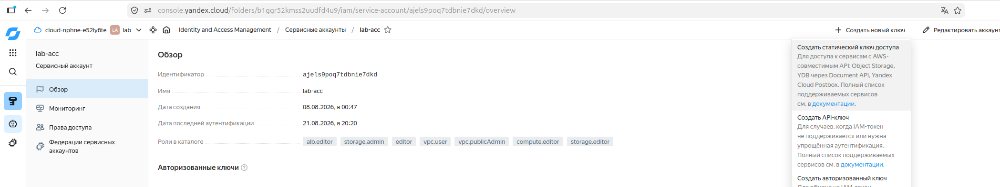
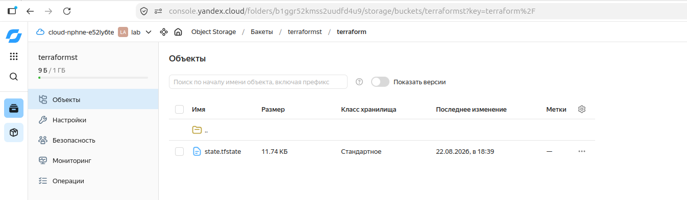
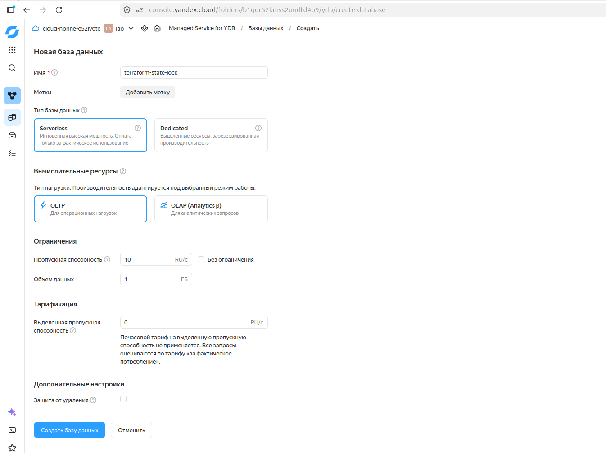
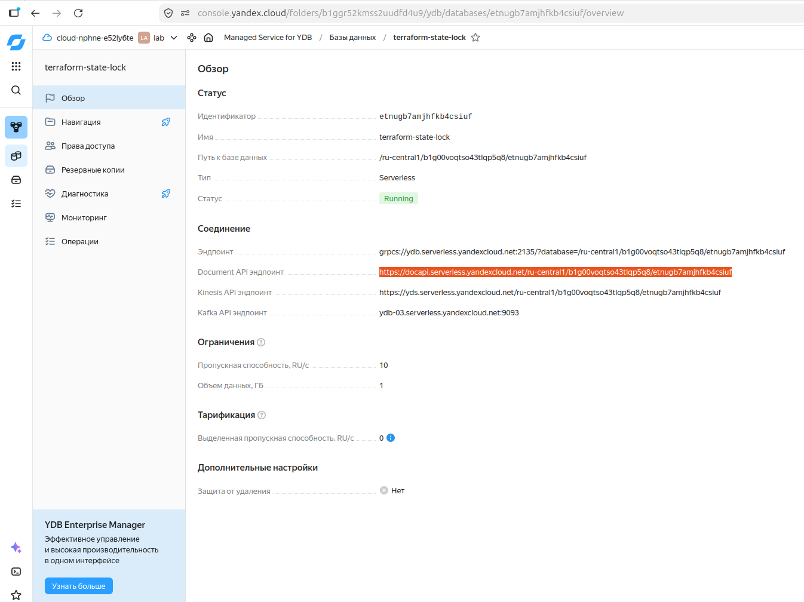
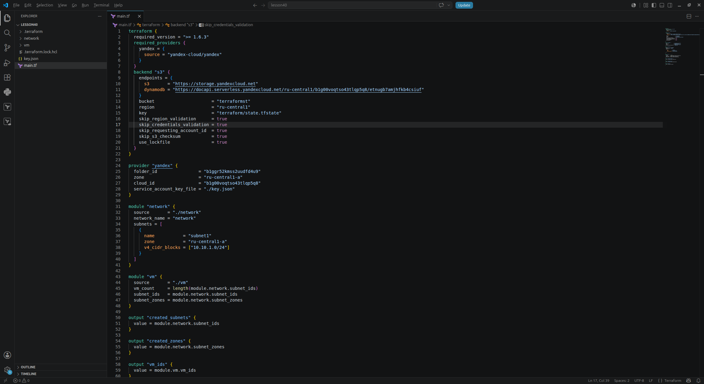

# Отчет: Terraform - Part2

Файл main.tf с блокировкой в s3

Создание s3

Редактирование ACL

Создаем статические ключи

Terraform использует s3 для хранения state

Создаем базу

Копируем api endpoint

Обновляем main.tf для использования бд

