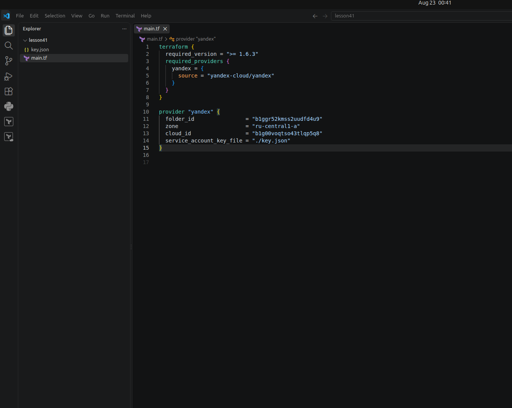
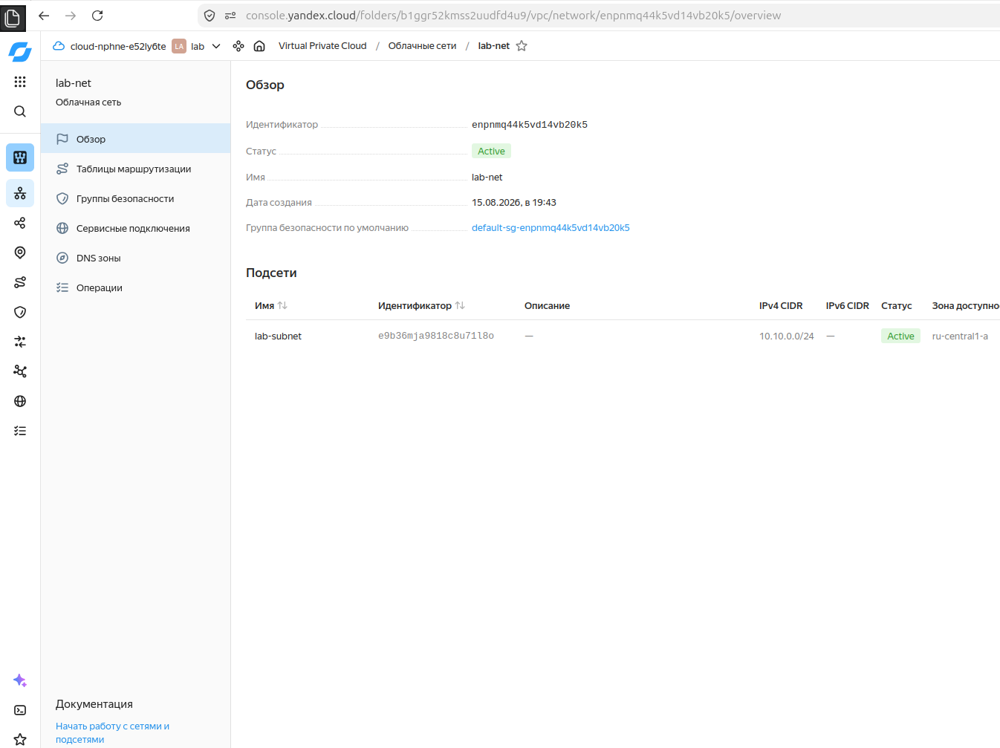
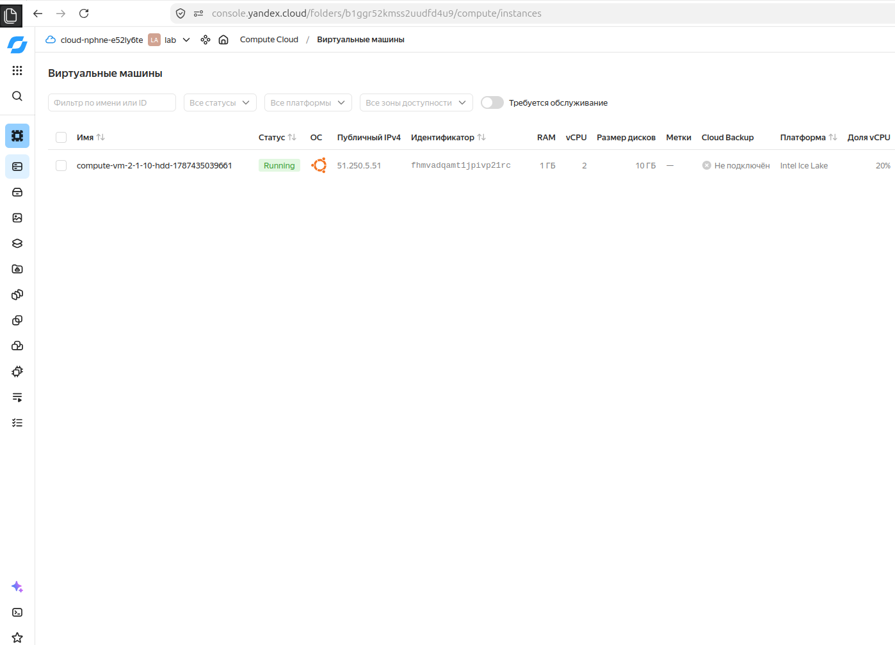
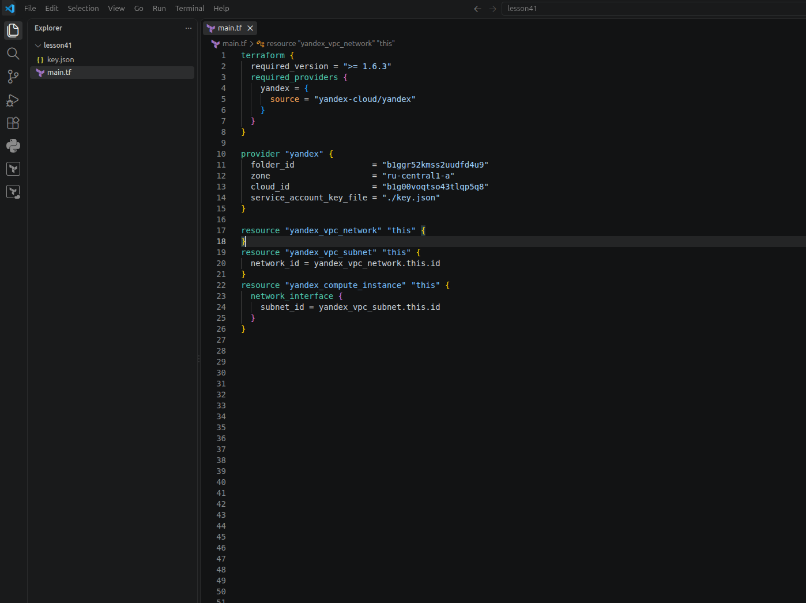
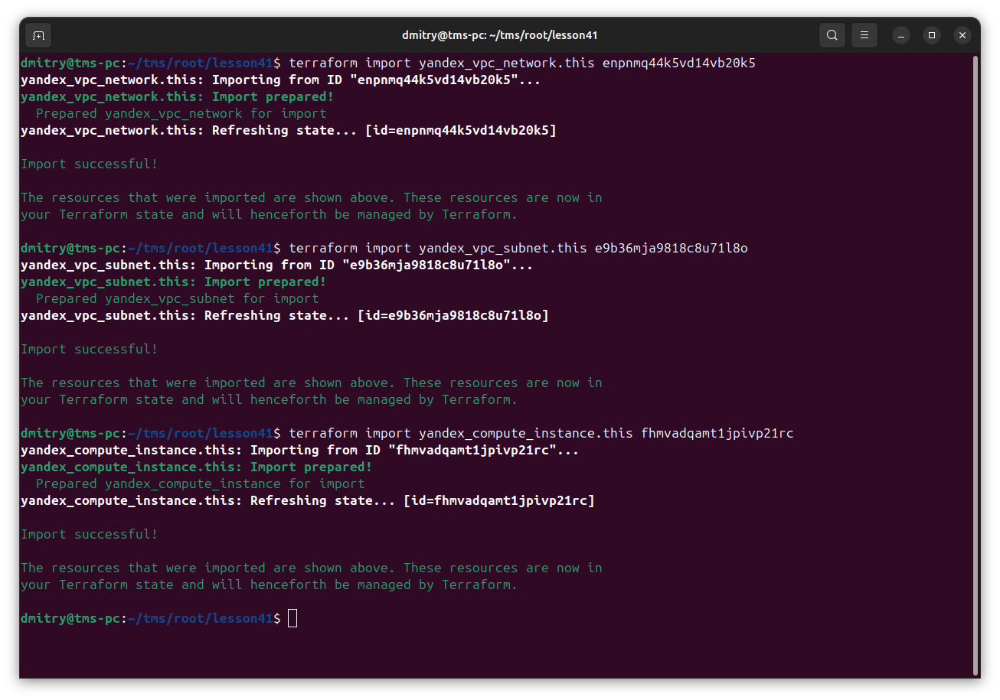
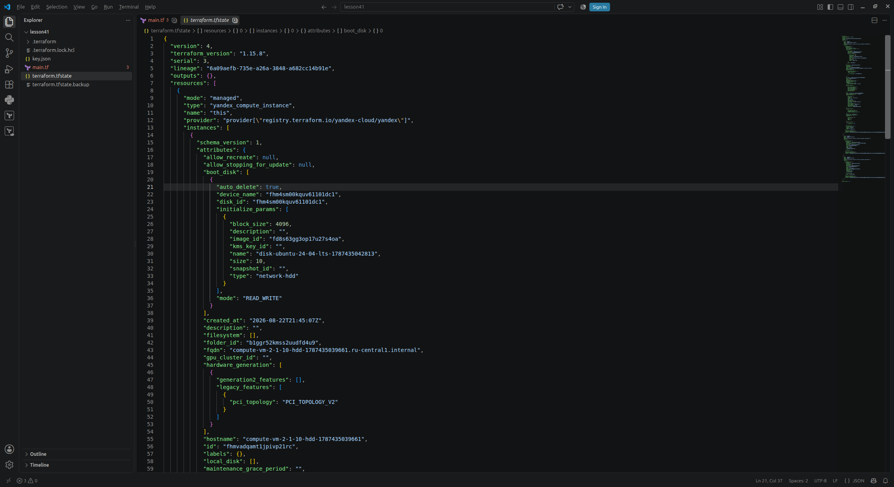
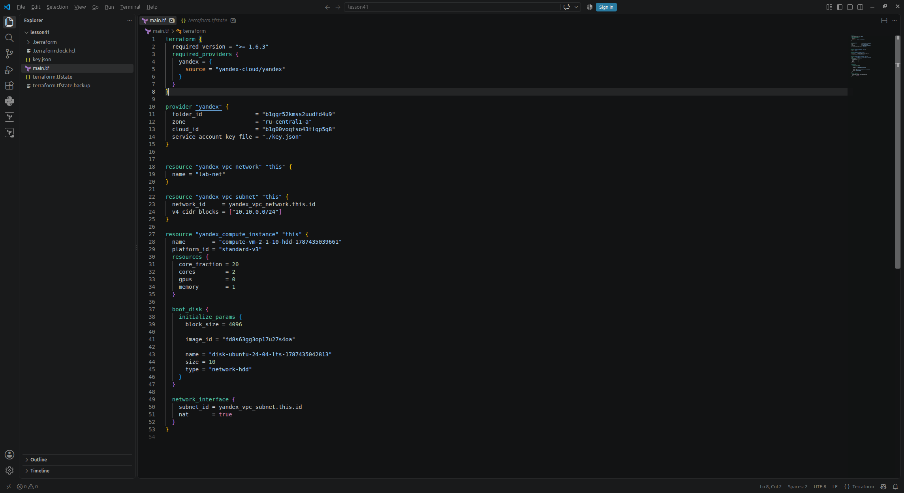
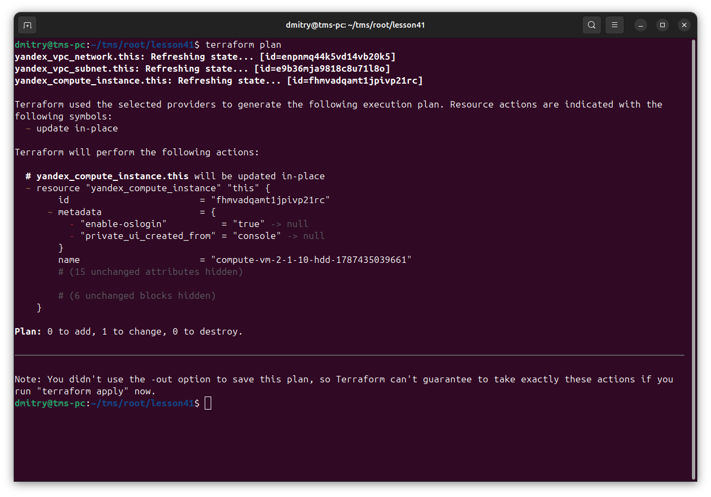
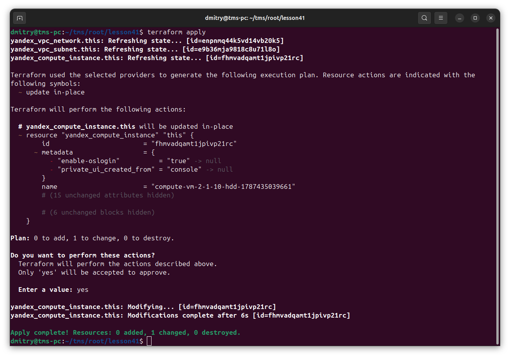
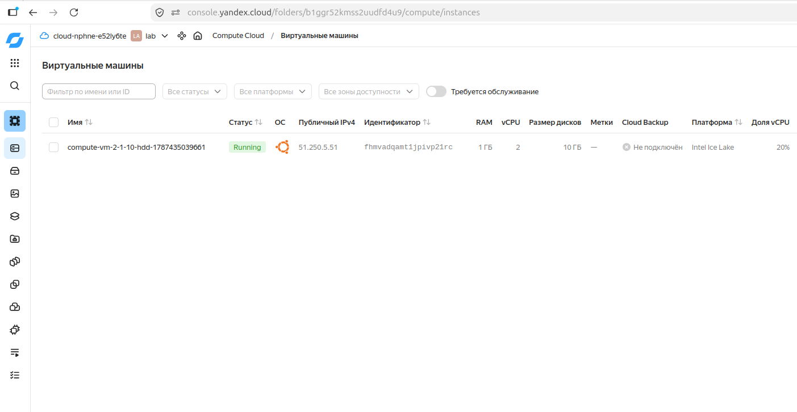

# Отчет: Terraform - Part3

Пустой main.tf

Создаем сеть и подсеть

Создаем виртуалку

Состояние main.tf перед импортом

Импортируем ресурсы

Ресурсы появились в state

Копируем поля из состояния в файл main.tf

План показывает, что всё в порядке

terraform apply

Проверяем, что всё в порядке

