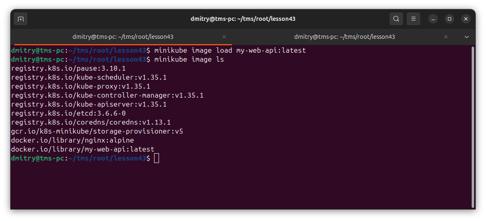
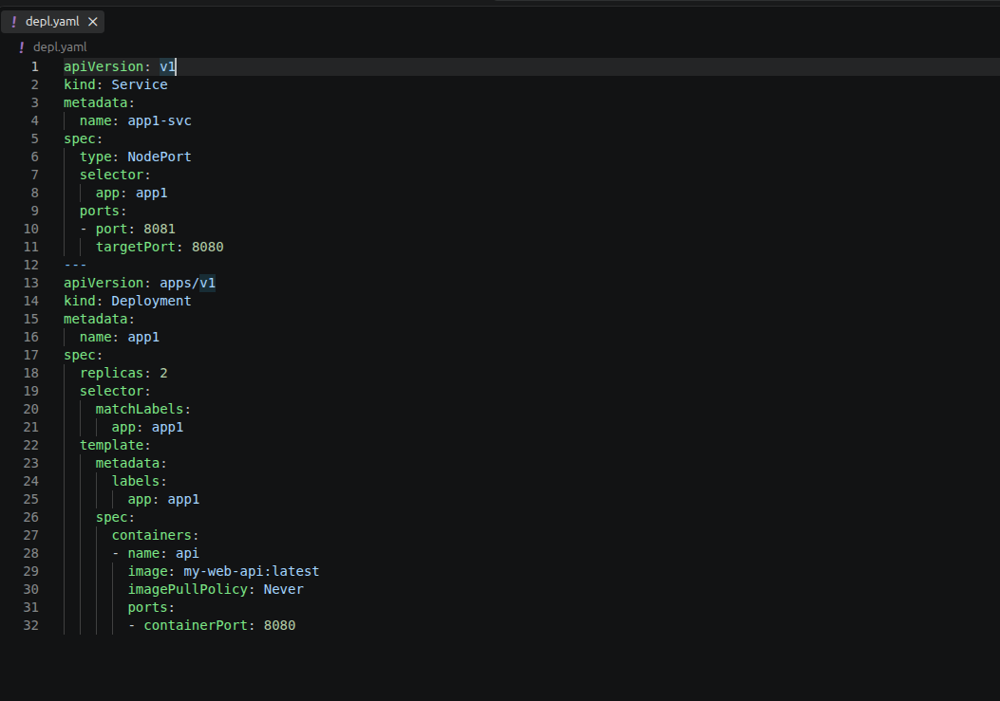
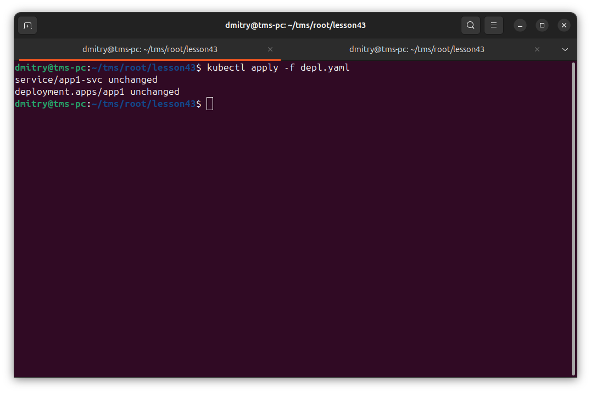
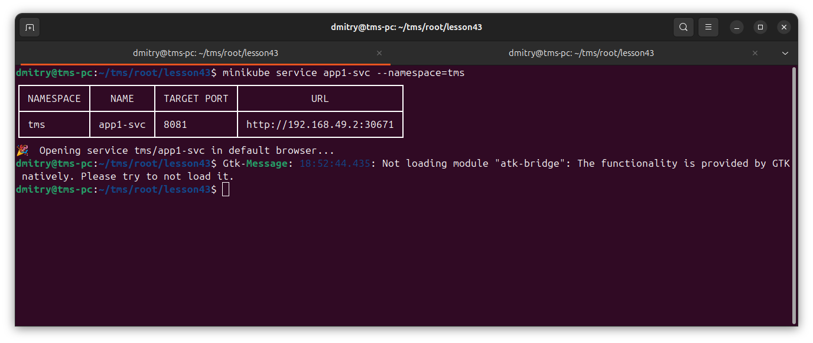
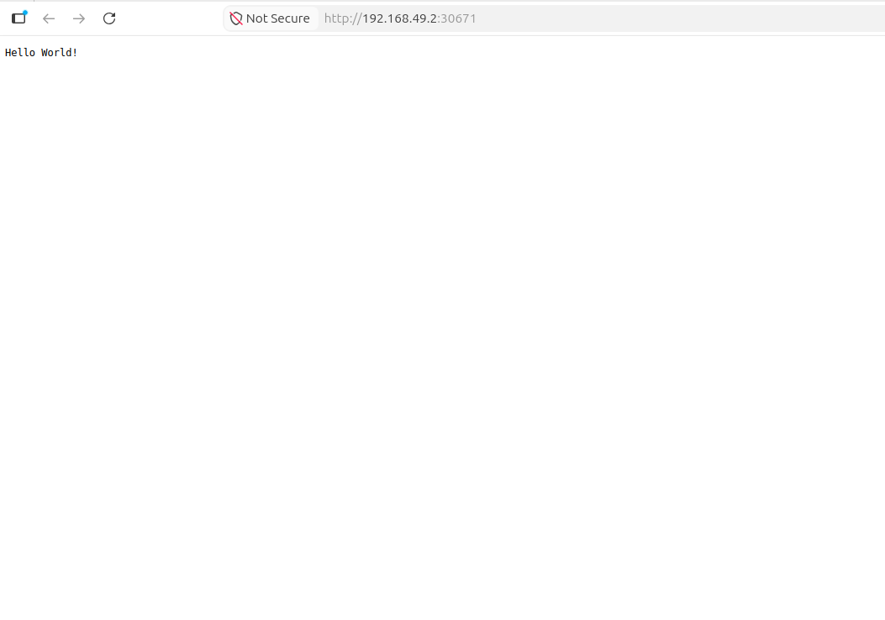
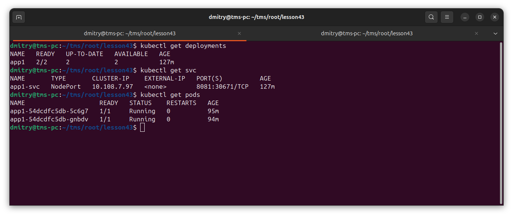
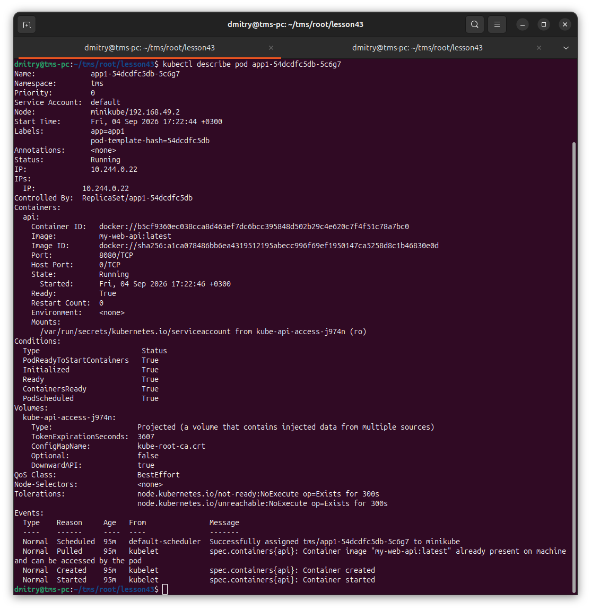
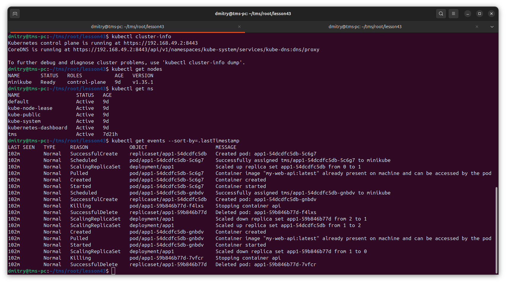
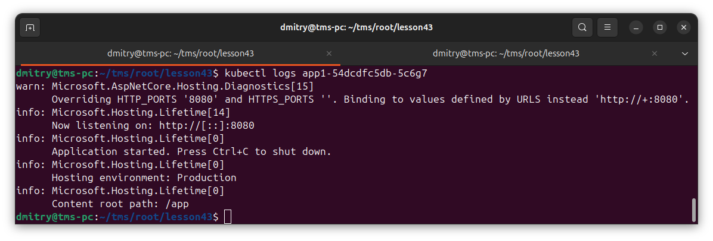

# Отчет: Kubernetes - Part1

## Теория:

Контейнеризация — это метод виртуализации на уровне операционной системы (OS-level virtualization), при котором ядро ОС поддерживает существование нескольких изолированных пространств пользователя (контейнеров) вместо одного.

Оркестрация контейнеров — это процесс автоматизированного управления жизненным циклом, координации и динамического распределения контейнеризированных приложений в распределенной вычислительной среде.

Масштабирование в архитектуре оркестраторов — это динамическое изменение объема вычислительных ресурсов, выделенных под приложение или инфраструктуру, с целью адаптации к изменениям входящего трафика и вычислительной нагрузки.


### Преимущества использования Kubernetes для развертывания и управления контейнеризированными приложениями

* Высокая доступность и отказоустойчивость (High Availability & Self-healing)
* Динамическое масштабирование (Scalability)
* Эффективное использование ресурсов (Resource Utilization)
* Декларативное управление (Declarative Configuration)
* Сетевое связывание и обнаружение сервисов (Service Discovery & Load Balancing)
* Независимость от провайдера (Cloud Agnostic / Portability)


### Kubernetes наиболее эффективен в сценариях, где требуется автоматизация, высокая доступность и обработка изменяющихся нагрузок.

* Микросервисная архитектура (Microservices)
* Системы с динамической и непредсказуемой нагрузкой
* Организация процессов CI/CD (Непрерывная интеграция и доставка)
* Мультиоблачные и гибридные инфраструктуры (Multi-cloud / Hybrid Cloud)
* Разработка Big Data приложений и Machine Learning (MLOps)
* Обеспечение жестких требований SLA по отказоустойчивости


### Архитектура Kubernetes делится на два основных слоя: уровень управления (Control Plane (master node)) и рабочие узлы (Worker Nodes).

Control Plane принимает глобальные решения о кластере (например, планирование подов), а также обнаруживает и реагирует на события в кластере.
* **API Сервер (kube-apiserver): Центральный узел управления** и единственная точка входа для всех запросов. Он предоставляет REST API, валидирует и конфигурирует данные для объектов (Pods, Services, Deployments). Все остальные компоненты взаимодействуют исключительно через него.
* **Хранилище etcd:** Высоконадежное, распределенное хранилище данных формата «ключ-значение». Используется как основное хранилище Kubernetes для всех данных кластера (конфигурации, состояния, секреты). Вся конфигурация дублируется сюда через API-сервер.
* **Планировщик (kube-scheduler):** Компонент, который отслеживает появление новых подов без назначенного узла и выбирает для них оптимальный рабочий узел (Worker Node) на основе доступных ресурсов, политик и ограничений.
* **Менеджер контроллеров (kube-controller-manager):** Запускает процессы контроллеров, которые следят за состоянием кластера и пытаются привести его к желаемому виду.
* **Cloud Controller Manager (опционально):** Связывает кластер с API облачного провайдера (например, для автоматического создания внешних балансировщиков нагрузки).

Рабочие узлы запущены на каждом сервере кластера; они обеспечивают работу подов и поддерживают среду выполнения контейнеров.

* **kubelet:** Основной системный агент Kubernetes, запущенный на каждом рабочем узле. Он следит за тем, чтобы контейнеры были запущены в поде и находились в здоровом состоянии, выполняя инструкции, полученные от API-сервера.
* **kube-proxy:** Сетевой прокси, работающий на каждом узле. Он отвечает за сетевые правила (iptables/IPVS), балансировку трафика и маршрутизацию сетевых запросов к нужным подам изнутри или снаружи кластера.
* **Среда выполнения контейнеров (Container Runtime):** Программное обеспечение, необходимое для запуска и управления контейнерами (например, containerd, CRI-O).


### Логика взаимодействия компонентов
1. Пользователь отправляет команду (например, через утилиту kubectl или CI/CD пайплайн) на создание нового приложения.
2. Запрос поступает в kube-apiserver, который валидирует его и записывает целевую конфигурацию в etcd.
3. kube-scheduler замечает через API-сервер новый под, анализирует свободные ресурсы рабочих узлов и назначает этот под на конкретный Worker Node. Результат назначения снова записывается в etcd.
4. kubelet, запущенный на назначенном узле, видит через API-сервер, что ему поручен новый под, и дает команду Container Runtime скачать образ и запустить контейнер.
5. kube-proxy настраивает сетевые правила на узле, чтобы к новому поду можно было обратиться по сети.
6. kube-controller-manager непрерывно опрашивает API-сервер, чтобы убедиться, что количество фактически запущенных контейнеров соответствует манифесту.


```
 ┌────────────────────────────────────────────────────────────────────────┐
 │                     CONTROL PLANE (MASTER NODE)                        │
 │                                                                        │
 │   ┌──────────────┐         ┌────────────────────┐         ┌──────────┐ │
 │   │  Разработчик │         │  kube-controller-  │         │   kube-  │ │
 │   │  (kubectl)   │         │      manager       │         │ scheduler│ │
 │   └──────┬───────┘         └─────────┬──────────┘         └────┬─────┘ │
 │          │                           │                         │       │
 │          ▼                           ▼                         ▼       │
 │   ┌────────────────────────────────────────────────────────────────┐   │
 │   │                       kube-apiserver                           │   │
 │   └──────────────────────────────┬─────────────────────────────────┘   │
 │                                  │                                     │
 │                                  ▼                                     │
 │                        ┌──────────────────┐                            │
 │                        │       etcd       │                            │
 │                        └──────────────────┘                            │
 └──────────────────────────────────┬─────────────────────────────────────┘
                                    │
       ┌────────────────────────────┴────────────────────────────┐
       │ (Связь через сетевой API)                               │
       ▼                                                         ▼
 ┌───────────────────────────────────────┐ ┌───────────────────────────────────────┐
 │             WORKER NODE 1             │ │             WORKER NODE 2             │
 │                                       │ │                                       │
 │ ┌───────────┐           ┌───────────┐ │ │ ┌───────────┐           ┌───────────┐ │
 │ │  kubelet  │◄─────────►│kube-proxy │ │ │ │  kubelet  │◄─────────►│kube-proxy │ │
 │ └─────┬─────┘           └─────┬─────┘ │ │ └─────┬─────┘           └─────┬─────┘ │
 │       │                       │       │ │       │                       │       │
 │       ▼                       │       │ │       ▼                       │       │
 │ ┌───────────┐                 │       │ │ ┌───────────┐                 │       │
 │ │ Container │                 │       │ │ │ Container │                 │       │
 │ │ Runtime   │                 │       │ │ │ Runtime   │                 │       │
 │ └─────┬─────┘                 │       │ │ └─────┬─────┘                 │       │
 │       ▼                       ▼       │ │       ▼                       ▼       │
 │ ┌───────────────────────────────────┐ │ │ ┌───────────────────────────────────┐ │
 │ │ Pod 1 (Контейнеры)                │ │ │ │ Pod 2 (Контейнеры)                │ │
 │ └───────────────────────────────────┘ │ │ └───────────────────────────────────┘ │
 └───────────────────────────────────────┘ └───────────────────────────────────────┘

```

----

Практика

Загружаем image



Deployment



Применяем файл



Получаем урл сервиса



Открываем страницу



Информация о ресурсах



Вызываем describe pod



Информация о кластере



Логи

