# Отчет: Kubernetes - Part2

Namespace — это логическая папка внутри одного кластера. Ресурсы с одинаковыми именами могут жить рядом, если они в разных namespace.
* Не мешать друг другу
* Разделить среды
* Ограничить доступ
* Квоты и лимиты
* Проще убирать мусор

Под — один или несколько контейнеров на ноде. Для приложения лучше Deployment: он сам пересоздаст под.

Контроллер держит желаемое состояние. Он следит за кластером и чинит отклонения: под умер — создаст новый.

**ReplicaSet**
* Гарантирует работу строго определенного количества одинаковых подов.
* Редко создается вручную, обычно управляется более высокоуровневыми объектами.
* Не умеет нативно и безопасно обновлять версии приложений.

**Deployment**
* Самый популярный контроллер для приложений без сохранения состояния (Stateless).
* Управляет несколькими ReplicaSet для бесшовного обновления.
* Поддерживает стратегии обновления.
* Позволяет легко откатиться на предыдущую версию (Rollback).

**StatefulSet** 
* Используется для приложений с сохранением состояния (Stateful), таких как базы данных.
* Назначает каждому поду уникальный постоянный идентификатор (например, pod-0, pod-1).
* Гарантирует строгий порядок при создании, обновлении и удалении подов.
* Привязывает к каждому поду его собственное постоянное хранилище (PersistentVolume), которое сохраняется даже при перезапуске пода.

---

Практика

Namespace

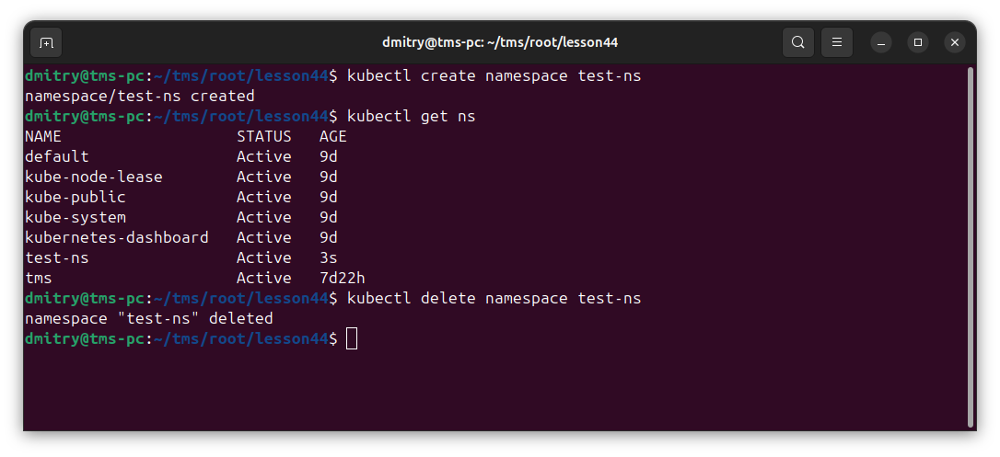
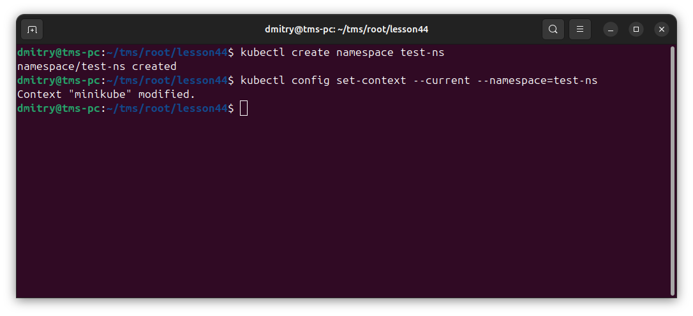

Создание простого пода через cli

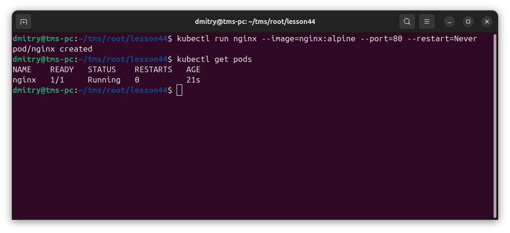

Deployment

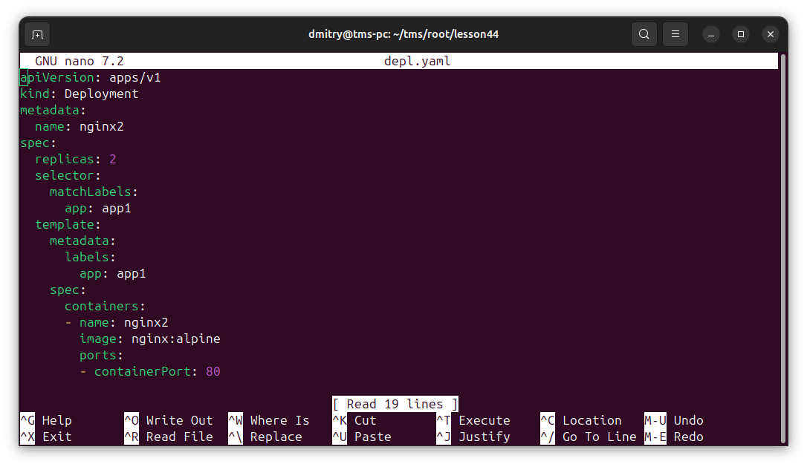

Применяем файл

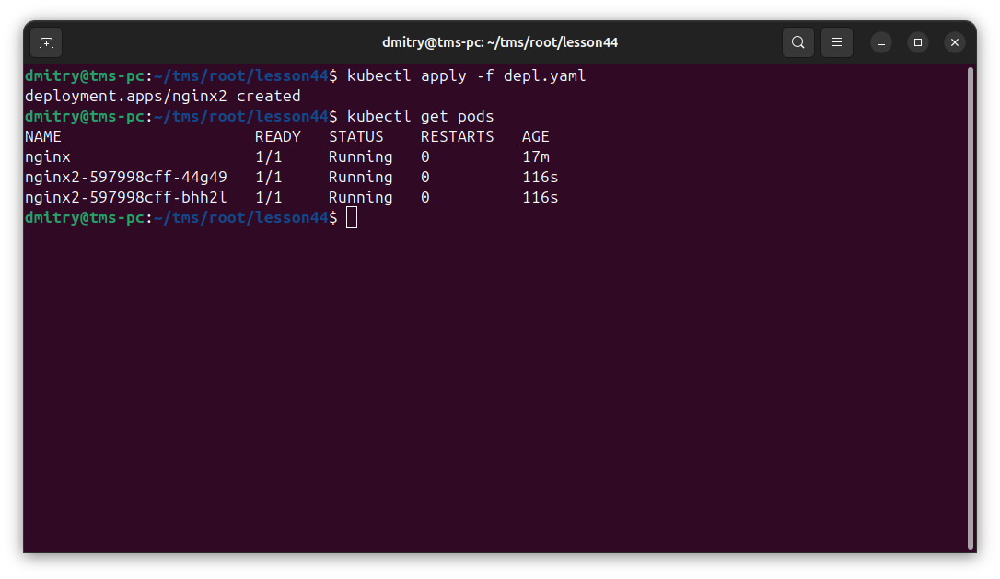

Отображение всех полей пода

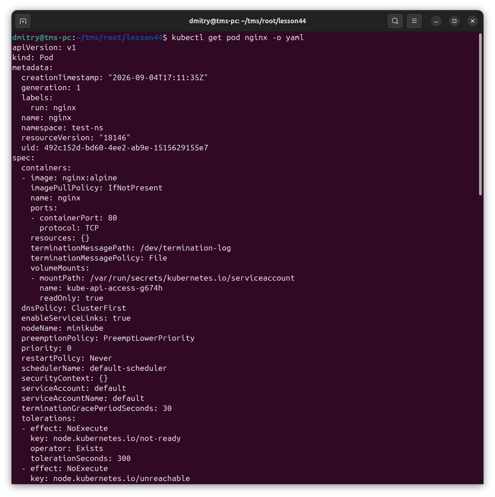

Вызываем describe pod

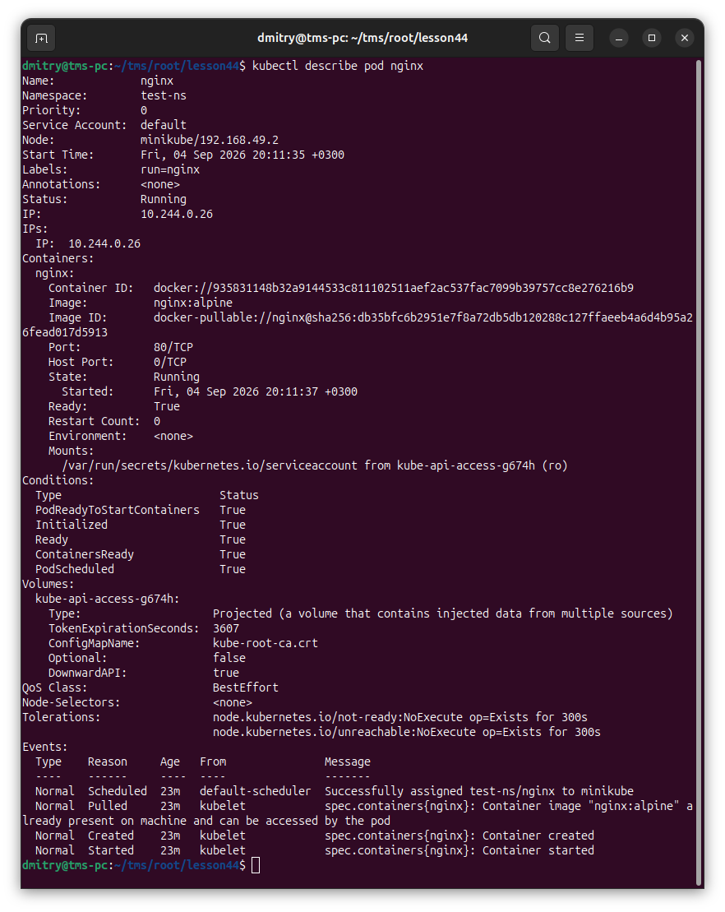

exec -it

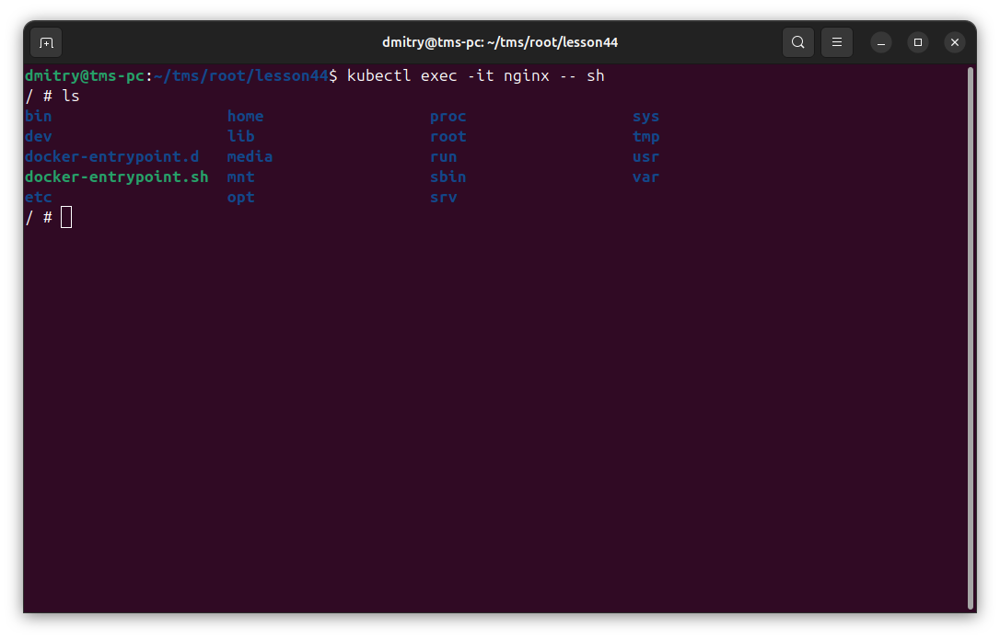

Применяем контроллеры

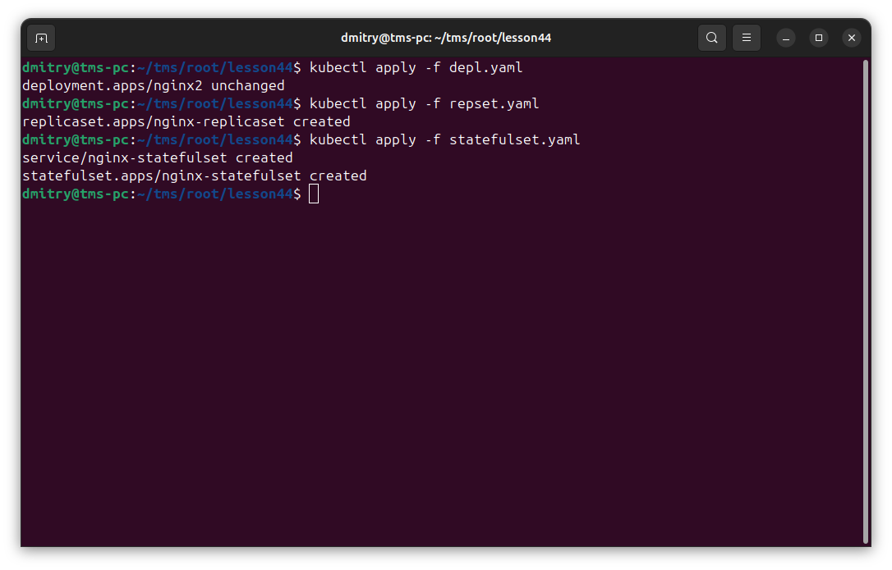

Получаем информацию о ресурсах

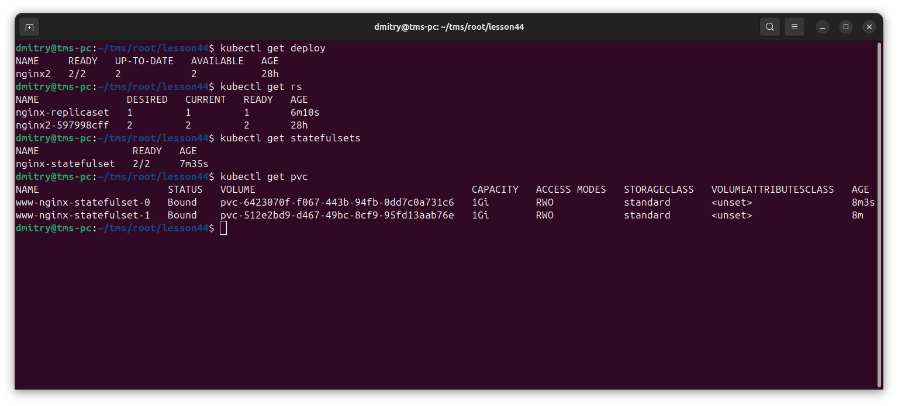

Масштабируем

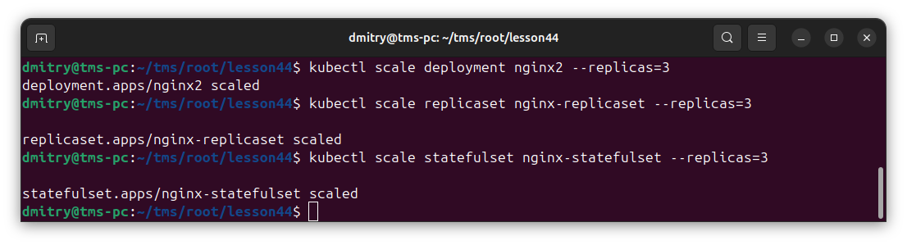
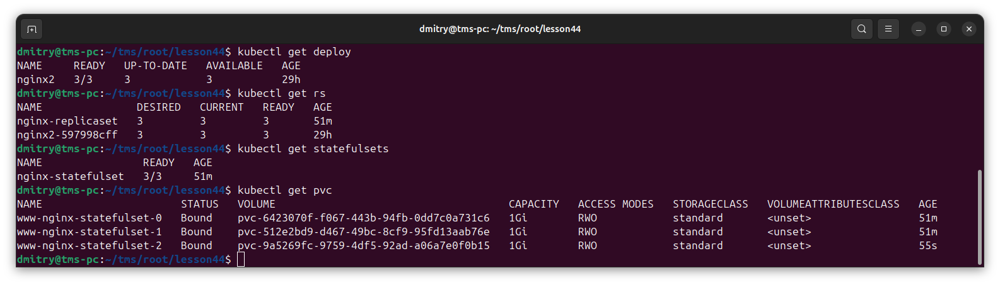

